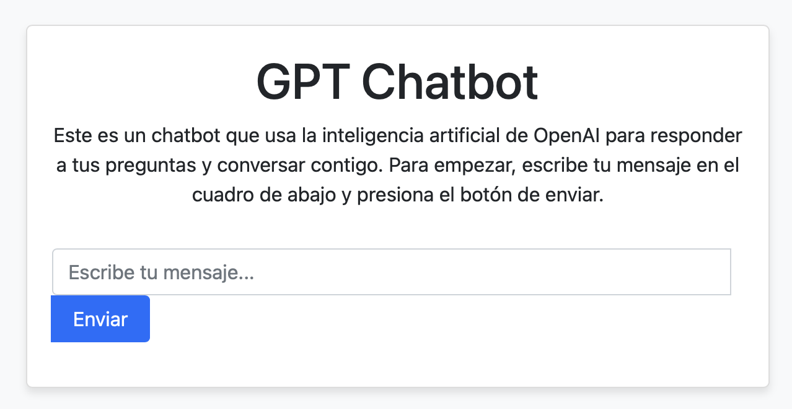

# OpenAI Chatbot with FastAPI: A Simple and Interactive Web Application for Conversational AI

## Introduction

This project is a web application that uses the OpenAI API to create an interactive chatbot that can answer the questions and comments of the users. The chatbot is based on the GPT-3 language model, which is capable of generating coherent and creative responses from a large amount of data. The web application is built with the FastAPI framework, which offers a fast and easy way to develop and deploy web applications with Python. The goal of this project is to demonstrate how conversational artificial intelligence can be integrated with a friendly and easy-to-use web interface.

## Features

Some of the features of this project are:

- Simple and elegant web interface that allows the user to send messages to the chatbot and see their responses.
- Intelligent and adaptable chatbot that can answer a variety of topics and styles of conversation.
- Integration with the OpenAI API, which offers access to one of the most advanced language models in the world.
- Use of FastAPI, a modern and efficient framework that facilitates the development and deployment of web applications with Python.

## Demonstration

Here is a screenshot of the web interface of the chatbot:



## Prerequisites

To run this project, you need the following:

- Python 3.12 or higher
- OpenAI API key
- FastAPI 0.70.0 or higher
- Uvicorn 0.15.0 or higher
- Requests 2.26.0 or higher

## Installation

To install this project, follow these steps:

1. Clone the repository:

    ```bash
    git clone https://github.com/YourUsername/openai-fastapi-chatbot.git
    cd openai-fastapi-chatbot
    ```

2. Create and activate a virtual environment with conda:

    ```bash
    conda create --name myenv python=3.12
    conda activate myenv
    ```

3. Install the dependencies with pip:

    ```bash
    pip install -r requirements.txt
    ```

4. Set your OpenAI API key as an environment variable:

    ```bash
    export API_KEY=your_actual_api_key
    ```

## Usage

To use this project, follow these steps:

1. Run the application with uvicorn:

    ```bash
    uvicorn main:app --reload
    ```

2. Open the web interface in your browser: http://127.0.0.1:8000

3. Write a message and click on "Send" to interact with the chatbot.

4. Wait for the chatbot to respond and continue the conversation.

5. Have fun and explore the possibilities of the chatbot.

## Contribution

This project is open source and open to contributions. If you want to contribute, you can do the following:

- Create an issue to report a bug, propose a feature, or ask a question.
- Create a branch to work on your own idea or solution.
- Create a pull request to submit your code to the main repository.
- Follow the code of conduct and respect the other developers.
